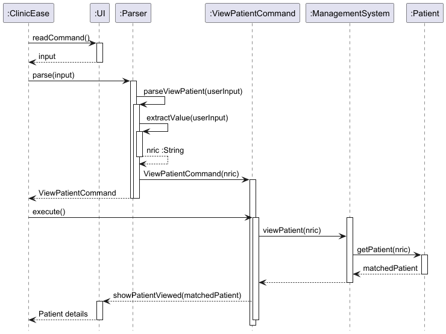
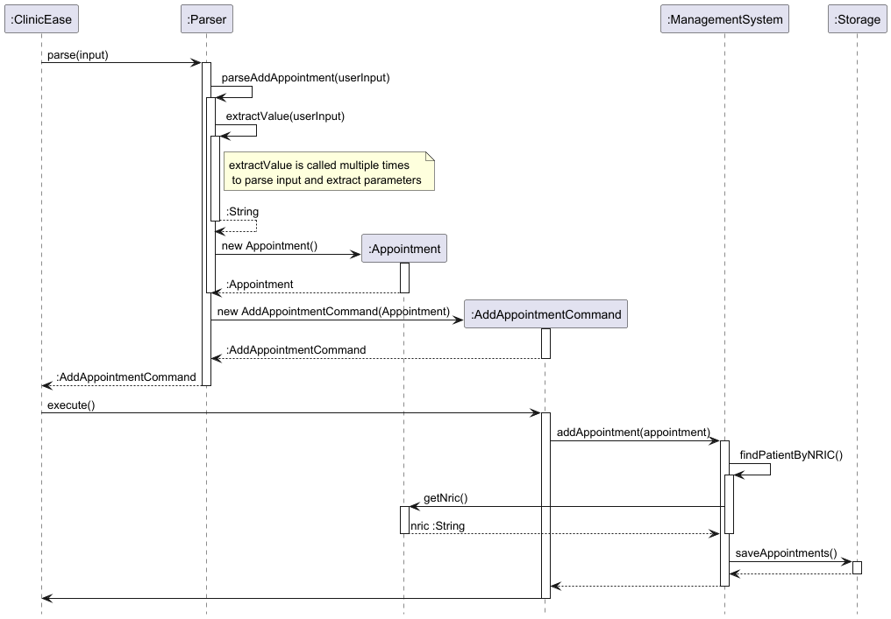
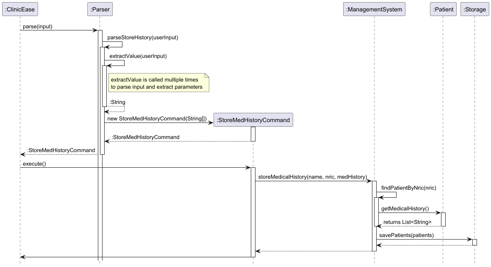

# Developer Guide

## Acknowledgements

{list here sources of all reused/adapted ideas, code, documentation, and third-party libraries -- include links to the original source as well}

## Design & implementation

{Describe the design and implementation of the product. Use UML diagrams and short code snippets where applicable.}

### View patient feature

The 'view-patient' feature allows the user to retrieve and view the personal details of a specified patient.

**Step 1.** The user launches the application for the first time.
- The `ClinicEase` will be initialized and load stored patient data.
- The patient’s details are now ready to view.

**Step 2.** The user executes `view-patient ic/S1234567D` command to view the patient's details.
- This command lets `ClinicEase` read the user input through the `UI` and pass it to `Parser`.
- The `Parser` class determines that the command is `view-patient` and creates a `ViewPatientCommand` object.

> [!NOTE]:  
> If the input does not match the expected format, an `InvalidInputFormatException` is thrown. Hence, the patient's details will not be retrieved.

**Step 3.** The system calls `execute()` method in `ViewPatientCommand`.
- This class calls for the patient list in `ManagementSystem`.
- The system checks if the patient exists in the list:
    - If the NRIC exists, the system retrieves the patient’s details.

**Step 4.** If the patient is found, the system calls `showPatientViewed()` from `UI`.
- The patient's details are displayed to the user.

The sequence diagram below illustrates how the operation for 'view-patient' would be executed in the system.




### Add appointment feature
The `add-appointment` feature allows users to schedule appointments for registered patients. 
The system ensures that the **patient exists** before adding the appointment. The appointment is then stored persistently.

Given below is an example usage scenario and how the `add appointment` mechanism behaves at each step.

Step 1. The user launches the application for the first time. The `ClinicEase` will be initialized with the....
The system loads the stored list of patients and appointments. The user is now ready to add a new appointment.

Step 2. The user executes `add-appointment ic/S1234567D ...` command to add the appointment to the appointment list. 
This command let `ClinicEase` class reads the user input and passes it to the `Parser`. 
The `Parser` class determines that the command is `add-appointment` and creates an `AddAppointmentCommand` object.

> [!NOTE]:
> If the input does not match the expected format, an InvalidInputFormatException is thrown. Hence, the appointment will
> not be successfully added and stored. 

Step 3. The system calls `execute()` method in `AddAppointmentCommand`. Then, this class calls `ManagementSystem.addAppointment()` 
to add the appointment to the system. `ManagementSystem` checks if the patient exists using `findPatientByNRIC()`. 
If the patient is found, the system creates an `Appointment` object and adds it to the appointment list.
If the patient’s NRIC does not exist, a PatientNotFoundException is thrown. Thus, the appointment will not be successfully added and stored.

Step 4. After the appointment is successfully added, `Storage.saveAppointments()` is called to update the saved appointment list.
If saving fails, `ClinicEase` catches an `UnloadedStorageException` and informs the user.

The following sequence diagram shows how an `add-aappointment` operation goes through the system:



### Storing Medical History Feature

The `store-history` feature allows users to **add new medical history entries** for a specific patient in the system.  
The system verifies that the **patient exists** before adding the entries, then the updated data is saved persistently.

Below is a usage scenario illustrating how the `store-history` mechanism behaves step by step.

---

**Step 1.** The user executes a command such as:

store-history n/John Doe ic/S1234567A h/Diabetes,High Cholesterol
- **ClinicEase** reads this command and passes the input string to **Parser**.
- **Parser** identifies the command as `store-history` (based on the command word) and extracts the relevant parameters (`name`, `nric`, `h/` tokens).
- If the input is invalid (missing or malformed parameters), an `InvalidInputFormatException` is thrown, aborting the process.

**Step 2.** **Parser** creates a `StoreMedHistoryCommand` object with the extracted details:

- `StoreMedHistoryCommand` holds the `name` ("John Doe"), `nric` ("S1234567A"), and `medHistory` string ("Diabetes,High Cholesterol").

**Step 3.** `ClinicEase` invokes `StoreMedHistoryCommand#execute(...)`, which calls:

1. `ManagementSystem.storeMedicalHistory(name, nric, medHistory)`
2. `ManagementSystem` checks if the patient exists using `findPatientByNric(nric)`.
    - If **not found**, it prints an error, and **no** changes are made to storage.
    - If **found**, it splits `"Diabetes,High Cholesterol"` into an array of entries:
        - `"Diabetes"`
        - `"High Cholesterol"`
    - Then, it appends these entries to the patient’s existing `medicalHistory` list (skipping duplicates).

**Step 4.** `ManagementSystem` calls `Storage.savePatients(...)` to persist any changes to the patient data on disk:

- If saving fails, `UnloadedStorageException` is thrown, and `ClinicEase` displays an error to the user.

Below is a detailed **PlantUML** sequence diagram showing how a `store-history` operation moves through the system and includes the check for a valid patient:



## Product scope
### Target user profile

{Describe the target user profile}

### Value proposition

{Describe the value proposition: what problem does it solve?}

## User Stories

| Version | As a ... | I want to ... | So that I can ... |
|---------|----------|---------------|-------------------|
| v1.0    | doctor   | add my patients' personal details | I can add them into the system |
| v1.0    | doctor   | delete my patients' personal details | I can remove them from the system |
| v1.0    | doctor   | view my certain patient's personal details | I can view them in the system |
| v1.0    | doctor   | add appointments into my schedule | I can add appointments plan from a patient needed to be tracked |
| v1.0    | doctor   | delete appointments from my schedule | I can get rid of appointments no longer needed to track |
| v1.0    | doctor   | list my upcoming appointments | I can manage my time effectively without manual scheduling |
| v1.0    | doctor   | store patients' medical history | I can understand the patient's situation better |
| v1.0    | doctor   | check all medical histories for one certain patient | I can know what happened before the patient come |
| v2.0    | doctor   | add a new prescription for a patient | record the prescribed medications and instructions |
| v2.0    | doctor   | view all prescriptions for a patient | track the patient's medication history |
| v2.0    | doctor   | add symptoms to a prescription | document the patient's condition |
| v2.0    | doctor   | add special notes to prescriptions | provide additional instructions to patients |
| v2.0    | doctor   | generate a printable prescription | provide a professional document to the patient |

## Use Cases

### Use Case: Add a Patient

#### MSS
User requests to add a patient, adding the personal details.
ClinicEase adds the patient to the system.
ClinicEase confirms the patient has been added successfully.

Use case ends.

#### Extensions
1a. Required details are missing or incorrectly formatted.
1a1. ClinicEase displays an error message.
Use case resumes at step 1.

1b. A patient with the same NRIC already exists.
1b1. ClinicEase displays an error message.
Use case ends.

### Use Case: Delete a Patient

#### MSS
User requests to list patients.
ClinicEase displays a list of patients.
User requests to delete a specific patient from the list.
ClinicEase deletes the patient.

Use case ends.

#### Extensions
2a. The patient list is empty.
Use case ends.

3a. The given NRIC is invalid.
3a1. ClinicEase displays an error message.
Use case resumes at step 2.

### Use Case: Add an Appointment

#### MSS
User requests to add appointment, specifying the patient NRIC, date, time, and description.
ClinicEase verifies that the patient exists.
ClinicEase adds the appointment to the system.
ClinicEase confirms that the appointment has been added successfully.

Use case ends.

#### Extensions
2a. The patient does not exist in the system.
2a1. ClinicEase displays an error message.
Use case ends.

1a. Required details are missing or incorrectly formatted.
1a1. ClinicEase displays an error message.
Use case resumes at step 1.

### Use Case: Delete an Appointment

#### MSS
User requests to list appointments.
ClinicEase displays a list of appointments.
User requests to delete a specific appointment.
ClinicEase deletes the appointment.

Use case ends.

#### Extensions
2a. The appointment list is empty.
Use case ends.

3a. The given appointment ID is invalid.
3a1. ClinicEase displays an error message.
Use case resumes at step 2.

### Use Case: View a Patient's Medical History

#### MSS
User requests to view patient's medical history using the patient's NRIC.
ClinicEase retrieves and displays the medical history of the patient.

Use case ends.

#### Extensions
1a. The given NRIC is invalid or does not exist.
1a1. ClinicEase displays an error message.
Use case ends.

2a. The patient has no recorded medical history.
2a1. ClinicEase informs the user that no history is available.
Use case ends.

### Use Case: Edit a Patient's Details

#### MSS
User requests to edit a patient's details using the patient's NRIC and the new details.
ClinicEase verifies that the patient exists.
ClinicEase updates patient's details.
ClinicEase confirms the update was successful.

Use case ends.

#### Extensions
2a. The patient does not exist in the system.
2a1. ClinicEase displays an error message.
Use case ends.

1a. The provided new details are invalid or missing.
1a1. ClinicEase displays an error message.
Use case resumes at step 1.

### Use Case: Sort Appointments

#### MSS
User requests to sort appointments by date or by appointment ID.
ClinicEase sorts the appointments accordingly.
ClinicEase displays the sorted list.

Use case ends.

#### Extensions
1a. The appointment list is empty.
1a1. ClinicEase displays a message indicating there are no appointments to sort.
Use case ends.

1b. The sorting parameter is invalid.
1b1. ClinicEase displays an error message.
Use case resumes at step 1.

### Use case: Add a new prescription

**MSS**

1. Doctor requests to add a new prescription
2. System prompts for prescription details (patient ID, symptoms, medicines, optional notes)
3. Doctor enters the required information
4. System validates the patient ID exists
5. System generates a unique prescription ID
6. System saves the prescription
7. System displays success message with the prescription details

    Use case ends.

**Extensions**

* 4a. Patient ID does not exist
    * 4a1. System shows an error message
    * 4a2. Use case resumes at step 2

* 3a. Required fields are missing
    * 3a1. System shows error message with correct format
    * 3a2. Use case resumes at step 2

### Use case: View all prescriptions for a patient

**MSS**

1. Doctor requests to view all prescriptions for a patient
2. Doctor enters patient ID
3. System validates patient exists
4. System retrieves and displays all prescriptions for the patient

    Use case ends.

**Extensions**

* 3a. Patient ID does not exist
    * 3a1. System shows an error message
    * 3a2. Use case ends

* 4a. No prescriptions found
    * 4a1. System shows "No prescriptions found" message
    * 4a2. Use case ends

### Use case: View and generate HTML prescription

**MSS**

1. Doctor requests to view a specific prescription
2. Doctor enters prescription ID
3. System validates prescription exists
4. System displays prescription details
5. System generates HTML version
6. System shows location of generated file

    Use case ends.

**Extensions**

* 3a. Prescription ID does not exist
    * 3a1. System shows an error message
    * 3a2. Use case ends

* 5a. HTML generation fails
    * 5a1. System shows error message
    * 5a2. Use case ends

## Non-Functional Requirements
1. Should work on any mainstream OS as long as it has Java `17` or above installed.
2. The system should efficiently manage up to 1000 patients or appointments without any noticeable performance lag during typical usage.
3. A user with above average typing speed for regular English text (i.e. not code, not system admin commands) should be able to accomplish most of the tasks within 40 seconds using CLI commands.
4. All error messages should clearly indicate how to correct the invalid input.
5. Data files should be compatible across different OS platforms.
6. All functionality should be accessible via keyboard-only commands.

## Glossary
* *Mainstream OS* - Windows, Linux, Unix, macOS
* *Performance Lag* – A noticeable delay or slowdown in the system's response to user actions.
* *Error Messages* – System-generated messages that inform users of incorrect input and provide guidance on how to fix it.
* *OS Platform Compatibility* – The ability for data files and system functionality to work consistently across different operating systems.


## Instructions for Manual Testing

Below is a suggested guide for **manual testing** of the ClinicEase application in a Command Line Interface (CLI) environment. 

---

## 1. Getting Started

1. **Compilation**
   - Navigate to the project's root folder (where the `ClinicEase.java` and other `.java` files reside).
   - Compile the source files. For example:
     ```
     javac *.java
     ```
   - Alternatively, use your favorite IDE's build tool.

2. **Launching the Application**
   - Run the compiled main class:
     ```
     java ClinicEase
     ```
   - You should see a welcome message that looks like this:
     ```
     --------------------------------------------------------------------------------
     Welcome to ClinicEase!
     Type a command, or 'bye' to exit.
     --------------------------------------------------------------------------------
     >
     ```

3. **Exiting the Application**
   - To exit, type:
     ```
     bye
     ```
   - Expected output:
     ```
     --------------------------------------------------------------------------------
     Goodbye!
     --------------------------------------------------------------------------------
     ```
   - The program will then terminate.

---

## 2. Testing Patient Management Features

### 2.1 Add a New Patient

**Command Format**: `add-patient n/NAME ic/NRIC dob/BIRTHDATE g/GENDER p/PHONE a/ADDRESS [h/MEDICAL_HISTORY]`

- `[h/MEDICAL_HISTORY]` is optional and can be multiple entries separated by commas.

**Steps to Test**
1. Input:
   ```
   add-patient n/Alice Tan ic/S1234567A dob/1990-01-01 g/F p/91234567 a/123 Bedok Road h/High blood pressure
   ```
2. Expected output:
   ```
   --------------------------------------------------------------------------------
   Patient added successfully: Alice Tan
   --------------------------------------------------------------------------------
   ```
3. The system should store the new patient data (written to `patient_data.txt`).

**Additional Test Cases**
- **Missing required fields** (e.g., no `a/ADDRESS`) should produce an `InvalidInputFormatException` message.
- **Duplicate NRIC** should produce a `DuplicatePatientIDException`.

---

### 2.2 List All Patients

**Command Format**: `list-patient`

**Steps to Test**
1. Input:
   ```
   list-patient
   ```
2. If you have existing patients, the system displays each patient in a list format:
   ```
   ------------------------------------------Patient Details------------------------------------------
   Patient NRIC: S1234567A Name: Alice Tan ...
   --------------------------------------------------------------------------------
   ```
3. If no patients exist, the system prints:
   ```
   --------------------------------------------------------------------------------
   No patients have been added.
   --------------------------------------------------------------------------------
   ```


---

### 2.3 View a Patient by NRIC

**Command Format**: `view-patient NRIC`

**Steps to Test**
1. Input:
   ``` 
   view-patient S1234567A
   ```
2. If the patient is found, detailed information is displayed. Otherwise, the system notifies you that no matching patient was found.

---

### 2.4 Delete a Patient

**Command Format**: `delete-patient NRIC`


**Steps to Test**
1. Input:
   ``` 
   delete-patient S1234567A
   ```
2. If the patient exists, the system confirms deletion:
   ```
   --------------------------------------------------------------------------------
   No patients have been added.
   --------------------------------------------------------------------------------
   ```
3. If the patient doesn't exist, it notifies you accordingly.

---


### 2.5 Edit Patient Information

**Command Format** `edit-patient ic/NRIC [n/NAME] [dob/BIRTHDATE] [g/GENDER] [a/ADDRESS] [p/PHONE]`

- `ic/NRIC` is required to locate the patient.
- The remaining fields are optional; include only those you want to edit.

**Steps to Test**
1. Input:
   ```
   edit-patient ic/S1234567A n/Alice Tan g/F a/321 Jurong Avenue
   ```
2. Expected output upon success:
   ```
   --------------------------------------------------------------------------------
   Patient with NRIC S1234567A updated successfully.
   Edit-patient command executed.
   --------------------------------------------------------------------------------
   ```
3. Use `view-patient S1234567A` to confirm the updated details.

---

## 3. Testing Medical History Features

### 3.1 Store Medical History

**Command Format**: `store-history n/NAME ic/NRIC h/HISTORY`

- `h/HISTORY` can contain multiple entries separated by commas.

**Steps to Test**
1. Input:
   ```
   store-history n/Bob Lee ic/S7654321B h/Diabetes,High cholesterol

   ```
2. If the patient doesn't exist, the system creates a new one and prints a confirmation message. If the patient exists, it simply adds new history entries.

---

### 3.2 View Medical History

**Command Format**:
1. By NRIC: `view-history ic/NRIC`
2. By Name: `view-history NAME`


**Steps to Test**
1. Input:
   ```
   view-history ic/S7654321B
   ```
2. Displays the patient's history if found. Otherwise, notifies you that it cannot find the patient.

---

### 3.3 Edit Medical History

**Command Format**: `edit-history ic/NRIC old/OLD_TEXT new/NEW_TEXT`

**Steps to Test**
1. Input:
   ```
   edit-history ic/S7654321B old/Diabetes new/Type 2 Diabetes
   ```
2. If `old/Diabetes` matches an existing record, the system replaces it with `Type 2 Diabetes` and prints a confirmation message.

---

## 4. Testing Appointment Features

### 4.1 Add an Appointment

**Command Format**: `add-appointment ic/NRIC dt/DATE t/TIME dsc/DESCRIPTION`

- Date: `yyyy-MM-dd`
- Time: `HHmm` (24-hour format)

**Steps to Test**
1. Input:
   ```
   add-appointment ic/S1234567A dt/2025-12-01 t/0930 dsc/Dental Checkup
   ```
2. If the patient is found, the system adds the appointment and shows a success message. If the patient doesn't exist, it prints an error.

---

### 4.2 List Appointments

**Command Format**: `list-appointment`

**Steps to Test**
1. Input:
   ```
   list-appointment
   ```

2. Shows all appointments if any exist. Otherwise, prints a "No appointments found" message.

---

### 4.3 Sort Appointments

**Command Format**:
1. by date:`sort-appointment byDate`
2. by appointment id: `sort-appointment byId`

**Steps to Test**
1. Input:
   ```
   sort-appointment byDate
   ```
- Appointments should be sorted chronologically.

2. Input:
   ```
   sort-appointment byId
   ```
- Appointments should be sorted by their `Axxx` IDs.

---

### 4.4 Mark and Unmark an Appointment

**Command Format**: `mark-appointment APPOINTMENT_ID unmark-appointment APPOINTMENT_ID`

**Steps to Test**
1. Input:
   ```
   mark-appointment A100
   ```
- The system marks the appointment as done (`[X]`).
2. Input:
   ```
   unmark-appointment A100
   ```
- The system reverts the appointment to undone (`[ ]`).

---

### 4.5 Find an Appointment by NRIC

**Command Format**: `find-appointment NRIC`

**Steps to Test**
1. Input:
   ``` 
   find-appointment S1234567A
   ```
2. If any matching appointment is found, it prints the details. Otherwise, it prints "No appointment found."

---

## 5. Error Handling Scenarios

- **Unknown Commands**
- If you type something invalid like `randomCommand`, the system should respond:
 ```
 Unknown command. Please try again.
 ```
- **Missing or Invalid Parameters**
- For instance, `add-appointment` missing the `dt/DATE` should trigger an error message (`InvalidInputFormatException`).
- **Storage Failures**
- If there's an I/O error with reading or writing to `patient_data.txt`, you might see `UnloadedStorageException`.

---

## 6. Comprehensive Test Workflow

1. **Add multiple patients** and confirm they appear correctly with `list-patient`.
2. **Add detailed medical histories** with `store-history`; verify them using `view-history`.
3. **Add appointments** to different patients and use `list-appointment`, `sort-appointment`, `mark-appointment`, etc. to test appointment functionality.
4. **Delete a patient** and confirm the removal.
5. **Exit** the program with `bye`.

---

### Managing Prescriptions

1. Adding a new prescription

   Prerequisites: Patient with ID "S9876543B" exists in the system.

   Test case: `add-prescription ic/S9876543B s/Fever, Cough m/Paracetamol, Cough syrup nt/Take after meals`
   * Expected: Prescription is added. Details of the new prescription shown.

   Test case: `add-prescription ic/S9876543B s/Fever m/`
   * Expected: Error shown. Missing medicines field.

   Test case: `add-prescription ic/X1234567Y s/Fever m/Paracetamol`
   * Expected: Error shown. Patient ID does not exist.

2. Viewing prescriptions

   Prerequisites: At least one prescription exists for patient "S9876543B".

   Test case: `view-all-prescriptions S9876543B`
   * Expected: List of all prescriptions for the patient shown.

   Test case: `view-prescription S9876543B-1`
   * Expected: Details of the specific prescription shown. HTML file generated.

   Test case: `view-prescription INVALID-ID`
   * Expected: Error shown. Invalid prescription ID.

3. Generating HTML prescriptions

   Prerequisites: Valid prescription exists with ID "S9876543B-1".

   Test case: `view-prescription S9876543B-1`
   * Expected: HTML file generated in data/prescriptions folder.
   * Verify: Open the generated HTML file in a browser. Check that all prescription details are correctly displayed.

---